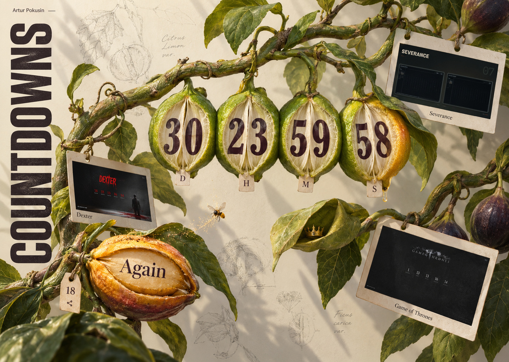
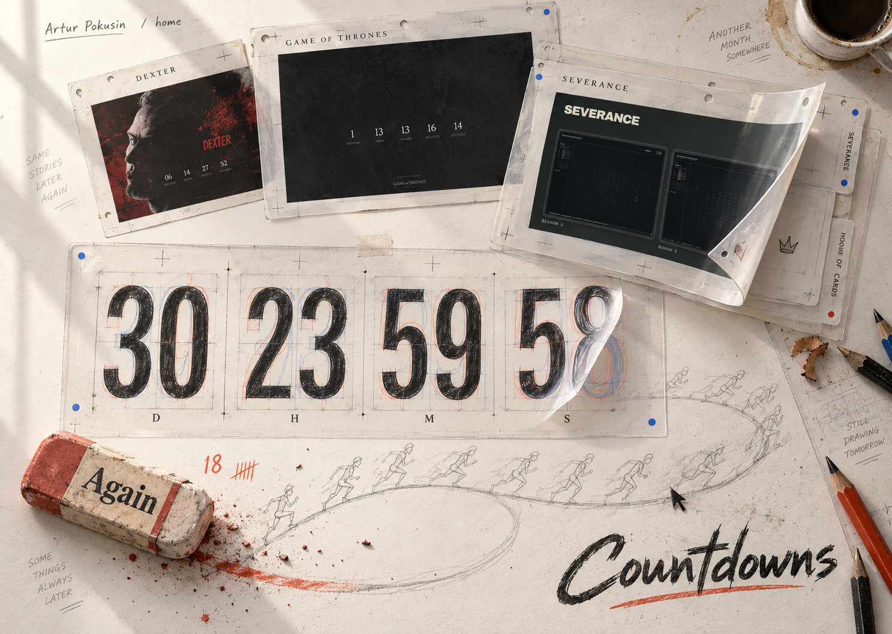
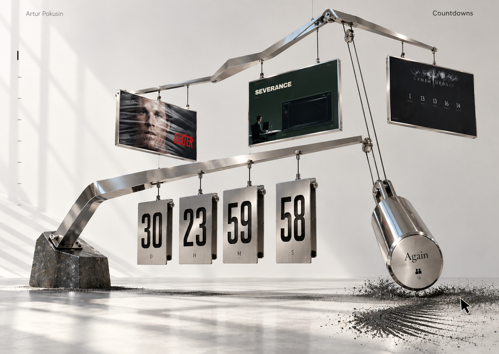
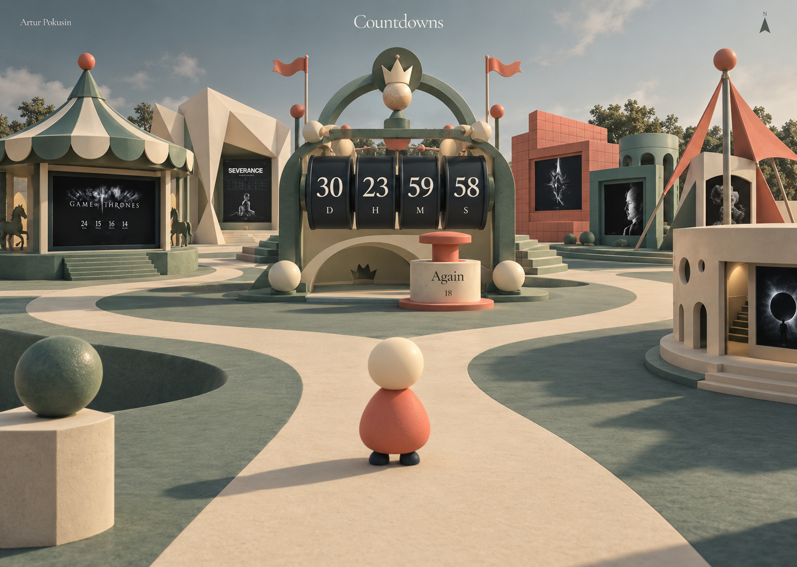
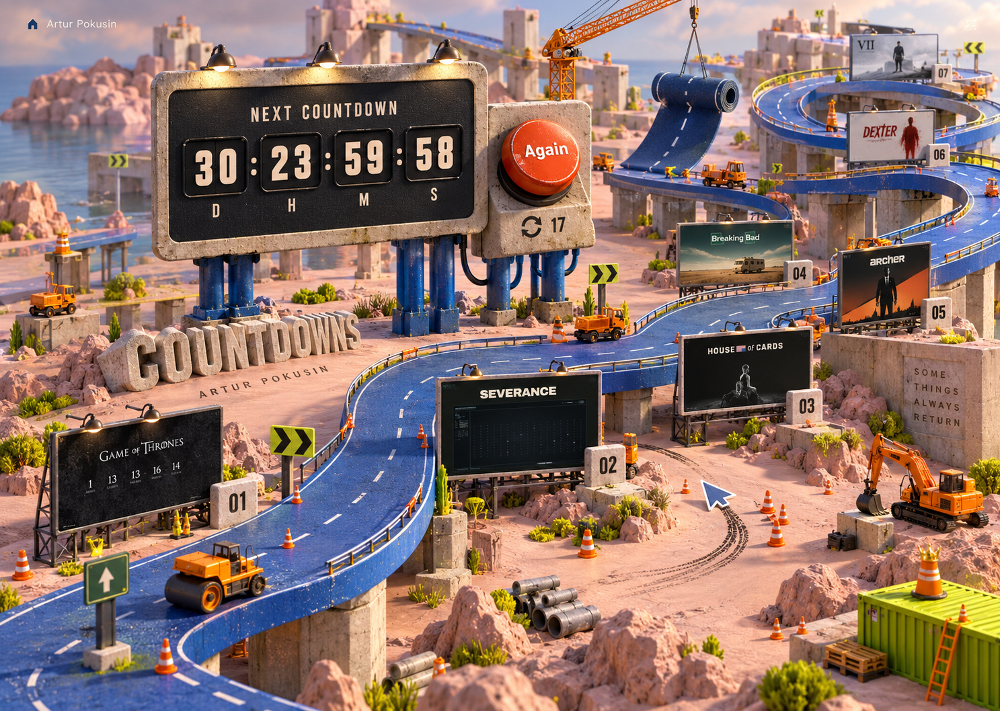

# Countdown worlds

**Architecture reset: seven rejected implementations; Fair retained.** The user rejected all non-Fair worlds for failing to resemble their original concepts. Previous visual acceptance is withdrawn. The original eight references remain here; seven complete scene-first execution specs now replace their earlier layout/material recipes. These are **plans, not rebuilt scenes**. Current seven preview links still show the rejected versions.

Start with the [architecture drawing board](architecture/README.md): source failures, seven distinct spatial compositions, authored asset pipeline, exact physical archive inventory, input ownership and staged fidelity gates. The [skeptical art review](architecture/challenge.md) distinguishes an improved plan from work that still needs production evidence. The Fair and its current runtime are outside this migration.

Every brief uses the same eleven sections: premise, composition, palette/type, geometry/materials, camera/lighting, interaction, motion, effects/budget, responsive/fallback behavior, implementation boundaries, and fidelity checks. Read the [shared implementation guide](GUIDE.md) before a concept brief. It preserves the real shared countdown, digit reels, archive content, preview interaction, and minimal copy.

## Existing comparisons

Use Worlds to switch between the existing themes. Fair is retained; the other seven below are rejected comparisons for diagnosing the architecture, not recommended new results. They still share the real countdown/tally/preview behavior.

| World | Preview | Art-director report |
| --- | --- | --- |
| Tomorrow’s Roadworks · rejected | [Existing](https://codex-next-countdown.pokusin-com.pages.dev/countdowns/?theme=tomorrows-roadworks) | [Report](reports/tomorrows-roadworks.md) |
| Bubblegum Time · rejected | [Existing](https://codex-next-countdown.pokusin-com.pages.dev/countdowns/?theme=bubblegum-time) | [Report](reports/bubblegum-time.md) |
| After the Flame · rejected | [Existing](https://codex-next-countdown.pokusin-com.pages.dev/countdowns/?theme=after-the-flame) | [Report](reports/after-the-flame.md) |
| Low Tide, Later · rejected | [Existing](https://codex-next-countdown.pokusin-com.pages.dev/countdowns/?theme=low-tide-later) | [Report](reports/low-tide-later.md) |
| Not Yet Ripe · rejected | [Existing](https://codex-next-countdown.pokusin-com.pages.dev/countdowns/?theme=not-yet-ripe) | [Report](reports/not-yet-ripe.md) |
| Still Drawing Tomorrow · rejected | [Existing](https://codex-next-countdown.pokusin-com.pages.dev/countdowns/?theme=still-drawing-tomorrow) | [Report](reports/still-drawing-tomorrow.md) |
| Held in Suspense · rejected | [Existing](https://codex-next-countdown.pokusin-com.pages.dev/countdowns/?theme=held-in-suspense) | [Report](reports/held-in-suspense.md) |
| The Almost Fair · retained | [Try](https://codex-next-countdown.pokusin-com.pages.dev/countdowns/?theme=the-almost-fair) | [Report](reports/the-almost-fair.md) |

[Browser review and evidence](../../design-qa.md) records desktop, phone, and interaction validation. The runtime uses procedural Three.js geometry and separately authored art layers; reference mockups are never used as full-page runtime backgrounds.

## New explorations

Numbers match the order in which the six new images appeared in the conversation. The earlier references remain outside this numbering.

| Option | Concept and complete spec | Art and layout | Interaction and confirmed-reset gag |
| --- | --- | --- | --- |
| 1 | [After the Flame](specs/after-the-flame.md) | Dramatic ivory wax canyon, burgundy darkness, archive recesses in irregular terraces | Bend the flame; wax rises to rebuild the candle |
| 2 | [Low Tide, Later](specs/low-tide-later.md) | Cyanotype shoreline, chalk timer cylinders, photographic sheets along a diagonal tide edge | Trace ripples; an incoming wave postpones emergence |
| 3 | [Not Yet Ripe](specs/not-yet-ripe.md) | Botanical specimen plate, oversized citrus clock pods, tags on one branching structure | Open leaves; fruit turns green again |
| 4 | [Still Drawing Tomorrow](specs/still-drawing-tomorrow.md) | Sunlit animation table, layered acetate, graphite and stepped drawn poses | Lift cels; an eraser removes and redraws the finish |
| 5 | [Held in Suspense](specs/held-in-suspense.md) | Monumental chrome cantilever, stone anchor, suspended archive and timer plates | Comb iron filings; a counterweight restores the unfinished balance |
| 6 | [The Almost Fair](specs/the-almost-fair.md) | Low-poly third-person fairground, seven physical exhibition pavilions, cream/jade/coral palette | Walk, orbit, or travel directly; a plunger rewinds the fair’s clock and interrupts its opening ceremony |

### 1. After the Flame

[Complete spec](specs/after-the-flame.md)

### 2. Low Tide, Later

[Complete spec](specs/low-tide-later.md)

### 3. Not Yet Ripe

[Complete spec](specs/not-yet-ripe.md)

### 4. Still Drawing Tomorrow

[Complete spec](specs/still-drawing-tomorrow.md)

### 5. Held in Suspense

[Complete spec](specs/held-in-suspense.md)

### 6. The Almost Fair

[Complete spec](specs/the-almost-fair.md)

The third-person reference establishes the player, branching promenade and clock landmark. The revised world uses porous limestone, plaster recesses, woven canvas, painted timber, satin machinery, a warm sun/cool sky and sparse distant trees. Traversal stays step-free; one hidden crown and the real clock/press tally replace the image's invented ornaments and values. The physical plan and native focus route provide equivalent direct access without a permanent website menu.

## Retained references

### Tomorrow’s Roadworks

[Complete spec](specs/tomorrows-roadworks.md): cobalt road loops, dusty pink concrete, orange machinery, archive billboards; a successful press unrolls another stretch of tomorrow.

### Bubblegum Time

[Complete spec](specs/bubblegum-time.md): mint space, a diagonal glossy gum clock, a cropped balloon, and curling archive prints; a successful press inflates and stretches the connected sculpture.

## Reference provenance

The images are independent ImageGen explorations, not screenshots of functioning software. JPG references preserve native composition and dimensions without resizing. Their numbers, incidental copy, and invented thumbnail details are placeholders; implementation uses real archive content and authoritative live values.

[Generation prompts](prompts.json) record the exact prompts for the six new explorations and identify the actual archive content used as grounding. [The manifest](manifest.json) records stable concept IDs, displayed order, dimensions, and original/reference checksums. The earlier two images are preserved as prior-round references; their exact original prompts are not reconstructed here.

The original generated PNGs remain in the generating task’s image store. Portable references are kept here so later agents do not depend on that local store. Each concept was reviewed by an art-director subagent before implementation. Its report identifies discoverability, physical feel, motion, and execution risks; the feedback is incorporated into the corresponding spec. Subsequent implementation notes document browser-driven refinements. The replacement architecture must now pass authored-asset and resting-frame gates before another implementation is accepted; the existing rejected scenes do not pass by virtue of their working controls.
