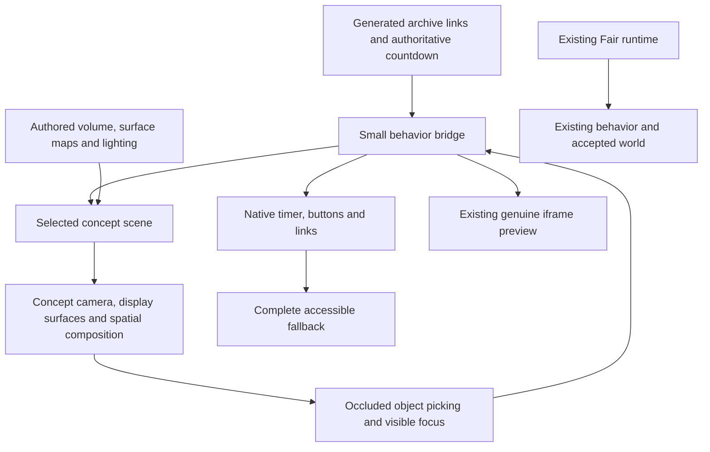

# Architecture reset

**Status: seven authored scene-first candidates implemented; final source/browser gates pending.** The user rejected all seven prior non-Fair implementations on October 2, 2026, and that rejection remains active until the replacements pass the original-reference comparison. The Almost Fair stays on its existing runtime. The current reports separate saved visual evidence from the later refinements still awaiting capture; a preview URL alone does not identify the candidate asset version.

The original seven images remain the visual targets. This is a reconstruction of their architecture, not seven new concepts. Read each image at native size before reading its spec. The reference controls and screenshots contain invented values/content; use the actual shared countdown and preserved archive instead. [Composition/type anchors](composition.md), [input ownership](input.md) and the [complete physical inventory](INVENTORY.md) make the handoff concrete.

## The failure

The earlier implementation shared a **page composition**, when it should have shared only behavior. `exhibition.js` creates an orthographic hero, moves exactly three archive anchors into it, projects DOM elements using a point and a world-X width, and leaves the remainder in HTML shelves below. Its `pin()` does not transfer a surface's orientation, perspective or occlusion. Changing texture noise, a light intensity or a CSS border cannot remove those constraints.

This made three kinds of failure recur:

1. **Geometry:** authored silhouettes became simple appliances, rods, cylinders and rims. Photographic scenery could not supply the missing volumes, contact, back surfaces or deformation.
2. **Composition:** source artwork became a front-facing clock and three regular previews, followed by a website gallery. Responsive rules lengthened the hero and stacked cards instead of composing the same artwork for a narrow view.
3. **Judgment:** functional checks were allowed to stand in for visual fidelity. Reports described major material/silhouette losses as accepted simplifications. Those verdicts are historical and superseded by the user's rejection.

The rejected published captures remain in [historical evidence](evidence/README.md). New actual local browser captures are in [rebuilt evidence](evidence/rebuilt/README.md); they record specific versions and remaining source gaps. The [implemented runtime audit](../runtime-audit.md) records exercised geometry/controllers and their limits. Specialist [sculpture](sculptures.md), [installation](installations.md) and [old runtime](runtime-audit.md) analyses retain the diagnosis that motivated this replacement.

## The replacement

Each concept is a complete, independently composed scene. Its camera, spatial archive, material objects, inscriptions and interaction system belong together. There is no mandatory hero, three-item mount array, gallery continuation, upright DOM clock or universal walkable world. Orthographic cameras remain appropriate for a tabletop or miniature when they preserve the source; camera choice itself was not the central failure.

| Concept | Scene structure | Navigation through the actual archive | Primary authored asset |
| --- | --- | --- | --- |
| [Tomorrow's Roadworks](../specs/tomorrows-roadworks.md) | Dense miniature quarry with a continuous elevated cobalt road | Travel along a bounded road camera rail; seven physical billboard stations, versions at each station | Terrain, bridge ribbon, construction objects and supported timer sign |
| [Bubblegum Time](../specs/bubblegum-time.md) | Diagonal connected membrane, four drum cavities, cropped bubble and curled photographs | Pan between unequal membrane attachment clusters; select a supported print | One sculpted gum body with deformation targets and actual openings |
| [After the Flame](../specs/after-the-flame.md) | Macro wax canyon; timer carved into foreground; work embedded in terraces | Move between authored canyon viewpoints and recesses | Continuous wax volume, drips, cavities, tapered candle and wick |
| [Low Tide, Later](../specs/low-tide-later.md) | Oblique shoreline with four eroded chalk posts and partly wet prints | Follow the diagonal shore between photographic clusters | Sculpted chalk/shell/paper and a depth-aware water surface |
| [Not Yet Ripe](../specs/not-yet-ripe.md) | One gnarled branching specimen, unequal cut fruit, veins and hanging tags | Follow the branch; open leaves and choose tagged specimens | Connected woody structure, four longitudinal citrus cuts and articulated foliage |
| [Still Drawing Tomorrow](../specs/still-drawing-tomorrow.md) | Overhead animation table, overlapping acetate folios, graphite clock and eraser | Pan the worktable and lift/fan actual folios | Curved acetate/paper meshes, hand-authored digit/stroke atlas, eraser and desk detail |
| [Held in Suspense](../specs/held-in-suspense.md) | Machined cantilever in a real architectural space, unequal hanging screens and counterweight | Move between suspended installation bays using the physical index | Beveled beam/pivot assembly, slate anchor, plates and reflection room |

All thirteen gallery works must be in the scene. Real archive-page links expose collapsed variants and timelines; the live Severance destination stays available. Do not silently turn thirteen works into three, invent more show versions, or fabricate thumbnails. A source image's three visible works are an opening composition, not the complete information model.

## Share behavior, not a visual template

The implemented `scene-host.js` is separate from `exhibition.js`; Fair, Royal and Control keep their existing paths. The seven `.scene.js` modules opt into the new full-viewport host. All thirteen works inhabit each spatial composition, and the original native archive remains the fallback. These are currently reviewed candidates, not seven certified source matches. A working module or a complete archive inventory does not bypass the art gates below.

The host owns just lifecycle, asset readiness, the authoritative value bridge, semantic action routing, a raycaster with occluders, and the existing modal. A concept supplies its own camera, scene graph, screen surfaces, material rig, navigation and motion controller. It can render directly or supply a measured effects chain. See [the behavior contract](../../../countdowns/concepts/CONTRACT.md) and [implemented runtime audit](../runtime-audit.md) for exact ownership and migration steps. The implementation remains static ES modules; an additional frontend framework or backend is not required.

Closed archive artwork is a faithful image **on an actual scene surface** with appropriate paper, aperture or frame geometry. Its real anchor is a semantic twin. On selection, the concept approaches a legible pose and invokes the existing real iframe modal. A screen fitting the approached object is permitted when its four corners are representable; the normal readable overlay is preferred over a distorted or tiny iframe. Closing restores exact navigation, object pose and focus.

Live clock/tally texture surfaces use the existing numerical reel model and one authoritative DOM representation. They participate in perspective, clipping, lighting and occlusion. They do not maintain another timer or wait for a decorative animation to update accessible values. Healthy scenes may visually clip their semantic twin, but cannot set it `hidden`, `inert`, `aria-hidden` or remove it from keyboard access. Focus must frame and visibly identify the corresponding object. Graphics/asset failure restores the complete native representation transactionally.

## Asset production is part of the architecture

Follow the [asset production plan](assets.md). Each concept needs an authored scene bundle with editable modeling/generation sources, named meshes, valid UVs, real thickness/cavities, material channels, relevant pivots/deformation targets and a matching light rig. Surface maps describe colour, roughness, microscopic normal and occlusion separately. Their existence does not compensate for missing geometry.

The selected Blender 4.5.14 LTS tool was used to author/export all seven bundles. Their scene directories now contain editable `.blend` sources, reproducible project-owned exporters, GLBs, separate surface maps, named-node manifests and inspection proofs. Official Three.js 0.180.0 GLTFLoader, BufferGeometryUtils and Reflector addons are vendored alongside the existing core. The site still has no build step. A clay or Cycles proof establishes authored geometry; the actual browser renderer remains the final material/lighting gate. Tool availability and asset existence no longer remain hypothetical, while source fidelity and measured device performance remain unresolved until tested.

Material complexity must be selective. Chrome needs architecture to reflect; wax needs volume/thickness and warm transmitted light; water needs depth/contact/refraction; paper needs actual curl, fibres, edges and receiving shadows. A full-screen mockup, an unlit cutout scenery plane, universal noise map, arbitrary glossy primitive or painted reflection stripe cannot stand in for these.

## Build one complete slice before expanding

Production began with **Held in Suspense**: its rigid mechanics expose the old projection, occlusion and material failures clearly, without adding soft-body simulation. Bubblegum then supplied the deforming geometry/curled-surface case. Each remains its own art direction; neither becomes a component template for the remaining five.

1. **Asset gate:** inspect the actual authored mesh in neutral clay, three-quarter view and silhouette. Check joints, thickness, underside, apertures, UVs and pivots. A blockout is useful here and explicitly cannot pass the final gate.
2. **Rest-frame gate:** render the opening view with final geometry, surfaces, lighting and faithful content. Compare at the original reference aspect ratio. Require source silhouette, scale, spacing, lens/angle, depth, material contrast and shadow/reflection structure. No cursor spectacle or reset animation can mask a failure.
3. **Complete slice:** include all four live units and slot transitions, Again plus real tally, one original archive preview, one further station/folio, one crown, native focus and failure recovery. Test several motion moments, with confirmation and rejected/pending responses separated.
4. **Narrow composition:** author actual 390/320 scene poses. Prove a readable clock, 44px actions, a reachable first work and all archive destinations. Do not accept a long stacked HTML gallery as the mobile interpretation.
5. **Expansion:** only after that slice passes, integrate all thirteen works and real archive-page links. Test restoration, touch intent, modified/new-tab links, reduced motion, synchronization, repeat input, actual context loss and disposal.

These gates remain the acceptance sequence even though the seven candidate archives have now been built. Separate skeptical art reviews compare actual asset/rest-frame/slice evidence. Reviews must state concrete source mismatches and evidence limits. The user's rejection cannot be overruled by changing a spec to describe the inferior render. Functional checks and art acceptance remain separate; frame-rate targets require profiling rather than a configured budget.

## Completion of this reset

The old shared hero/projection composition has been replaced by seven independently authored full scenes. Required asset sources and static exports now exist; native clock/state/preview behavior is shared without imposing one layout. Fourteen exact record stops and the complete thirteen-preview/seven-link inventory passed the controller harness in both tested profiles. The shared lifecycle audit covers disposal, pointer identity, preview cancellation and breakpoint reconstruction. These are implemented facts with explicit test limits. Saved art-director comparisons still identify material, geometry and portrait failures; no final source acceptance or device frame-rate claim follows from them. Fair and the shared countdown backend remain outside this replacement.
