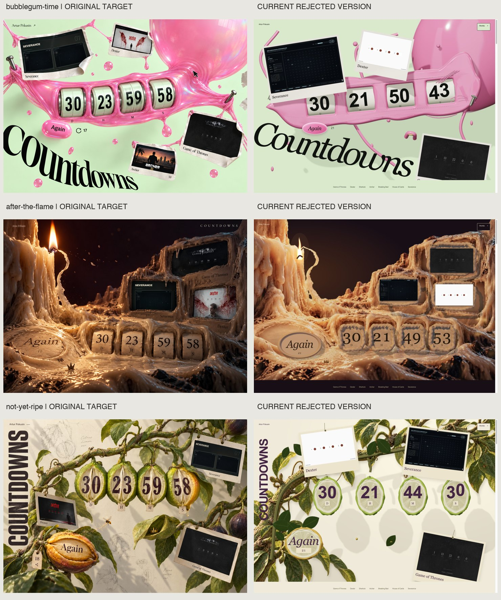
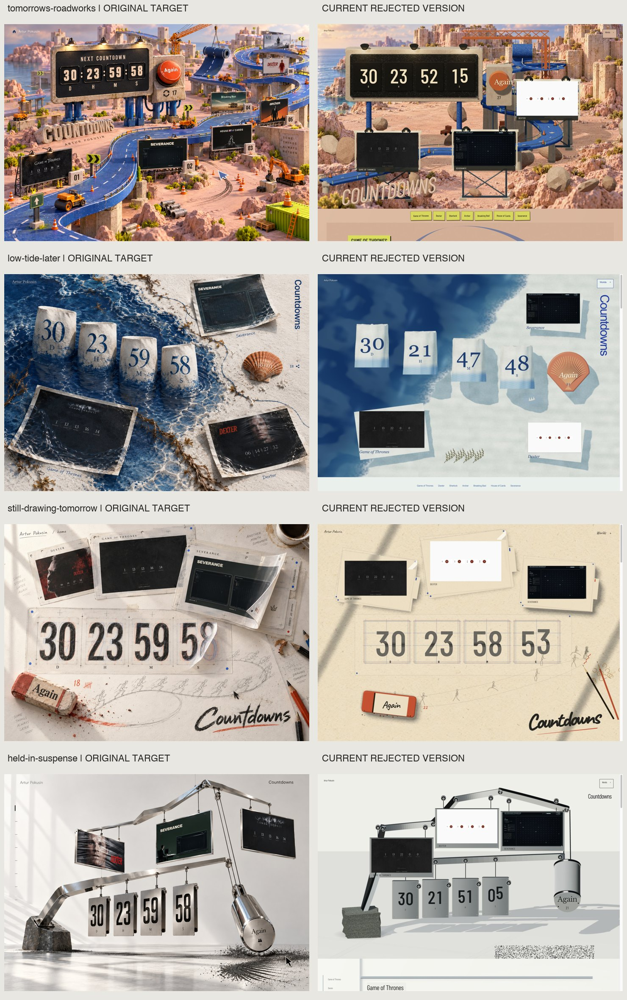

# Original artwork versus rejected published scenes

These are fresh captures of the published preview on **October 2, 2026**, with art version **4d7a9cd8ba**. They document the architectural mismatch that prompted this reset. They are not renders of the proposed replacement, and they do not certify new mobile layouts, interactions or performance. The Fair is excluded.

Every pair puts the original concept on the **left** and the existing rejected implementation on the **right**. Images are contained without stretching. The requested viewport was 1487 × 1058, matching the original reference dimensions; the browser's native capture was 1487 × 1058 for Roadworks and 1472 × 1047 for the other six. [Capture metadata](captures.json) records that difference. JPEGs are portable review copies; the native PNG captures are retained in the local task's visualization directory.

Live countdown and tally values can differ between frames. Real preserved archive screenshots deliberately replace the invented content in generated concept art. Dexter's white page with four red dots is its authentic archive design, not a failed image load. The findings below concern the physical composition, materials and scene structure around that content.

| Concept | Comparison | Architectural loss visible in the current scene |
| --- | --- | --- |
| Tomorrow’s Roadworks | [Original/current](tomorrows-roadworks-pair.jpg) · [Current capture](tomorrows-roadworks-current.jpg) | The connected miniature quarry and elevated road become distant photographic scenery, a simple foreground road and three flat billboards. The other work continues in webpage shelves instead of physical construction stations. |
| Bubblegum Time | [Original/current](bubblegum-time-pair.jpg) · [Current capture](bubblegum-time-current.jpg) | The gathered diagonal membrane, true drum openings, four curled prints and enormous cropped serif become a slab, detached opaque bubble, box-like clock faces and three regular previews. Surface detail does not restore the connected silhouette. |
| After the Flame | [Original/current](after-the-flame-pair.jpg) · [Current capture](after-the-flame-current.jpg) | The continuous wax volume is a canyon picture with detached foreground clock and action objects. The timer does not occupy carved cavities, and archive prints lack the source's recessed terraces and receiving shadows. |
| Low Tide, Later | [Original/current](low-tide-later-pair.jpg) · [Current capture](low-tide-later-current.jpg) | The oblique shoreline, eroded posts and wet paper become a blue shader field, four front-facing boxes, generic paper folds and a regular orange fan. Water lacks coherent depth, contact and refraction around the objects. |
| Not Yet Ripe | [Original/current](not-yet-ripe-pair.jpg) · [Current capture](not-yet-ripe-current.jpg) | The gnarled specimen and longitudinal cut fruit become a photographic tree backdrop, thin rods and repeated circular faces. Peel, pith, pulp relief, hanging tags and the compressed vertical title lose their distinct anatomy. |
| Still Drawing Tomorrow | [Original/current](still-drawing-tomorrow-pair.jpg) · [Current capture](still-drawing-tomorrow-current.jpg) | The overlapping animation folios and graphite construction drawing become neat flat previews, a stock numeral atlas and a stick figure. Acetate thickness, broad curls, transparent overlap and pressured illustration are absent. |
| Held in Suspense | [Original/current](held-in-suspense-pair.jpg) · [Current capture](held-in-suspense-current.jpg) | The cantilever in a reflective architectural space becomes a front-facing diagram of rails and outlined bolts. Squat numeral plates and a frontal endcap break the mechanism's proportions; brushed noise cannot supply room reflections or real joints. |

## Comparison sheets

The [architecture reset](../README.md) addresses these failures through independent scene composition, authored volumes and actual display surfaces. Its new production gates require original-versus-exported comparisons before an implementation earns visual acceptance.
